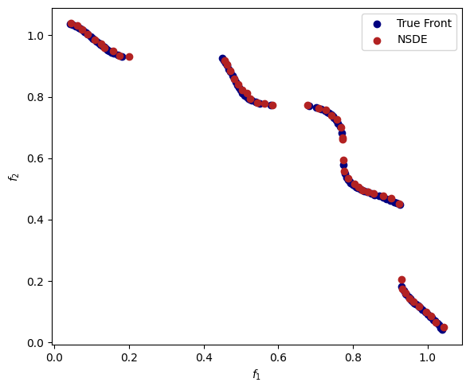

# pymoode
A Python framework for Differential Evolution using [pymoo](https://github.com/anyoptimization/pymoo) (Blank & Deb, 2020).

## Install
First, make sure you have a Python 3 environment installed.

From PyPi:
```
pip install pymoode
```

From the current version on github:
```
pip install -e git+https://github.com/mooscalia/pymoode#egg=pymoode
```

## Algorithms
- **DE**: Differential Evolution for single-objective problems proposed by Storn & Price (1997). Other features later implemented are also present, such as dither, jitter, selection variants, and crossover strategies. For details see Price et al. (2005).
- **NSDE**: Non-dominared Sorting Differential Evolution, a multi-objective algorithm that combines DE mutation and crossover operators to NSGA-II (Deb et al., 2002) survival. This is the version implemented by Leite et al. (2022). A self-adaptive strategy might be used to define mutation parameters from a range by using the SA parameter.
- **GDE3**: Generalized Differential Evolution 3, a multi-objective algorithm that combines DE mutation and crossover operators to NSGA-II survival with a mixed type survival strategy in which individuals might be removed in one-to-one comparison before Non-dominated Sorting. It is recommended to be used for problems in which premature convergence might be an issue. It was proposed by Kukkonen, S. and Lampinen, J. (2005).
- **NSDER**: Non-dominared Sorting Differential Evolution based on Reference directions (Reddy & Dulikravich, 2019). It is an algorithm for many-objective problems that works as extension of NSDE using NSGA-III (Deb & Jain, 2014) survival strategy.

## Survival Operators
- **RankSurvival**: Flexible structure to implement NSGA-II rank and crowding survival with different options for crowding metric and elimination of individuals.
- **ConstrainedRankSurvival**: A survival operator based on rank and crowding with a special constraint handling approach proposed by Kukkonen, S. and Lampinen, J. (2005).

## Usage
For more examples, see the example notebooks [single](./EXAMPLE_SOO.ipynb), [multi](./EXAMPLE_MULTI.ipynb), [many](./EXAMPLE_MANY.ipynb).

```
import matplotlib.pyplot as plt
from pymoo.factory import get_problem
from pymoo.util.plotting import plot
from pymoo.optimize import minimize as moo_minimize
from pymoode.nsde import NSDE

problem = get_problem("tnk")
```

```
nsde = NSDE(pop_size=50, CR=0.8, F=(0.2, 1.0), variant="DE/ranked/1/bin", SA=0.5)
    
res_nsde = moo_minimize(problem, nsde, ('n_gen', 200), save_history=True, verbose=True)
```

```
fig, ax = plt.subplots(figsize=[6, 5], dpi=100)
ax.scatter(pf[:, 0], pf[:, 1], color="navy", label="True Front")
ax.scatter(res_nsde.F[:, 0], res_nsde.F[:, 1], color="firebrick", label="NSDE")
ax.set_ylabel("$f_2$")
ax.set_xlabel("$f_1$")
ax.legend()
fig.tight_layout()
plt.show()
```


## Citation
Please cite this library via the original article in which it was published:

Leite, B., Costa, A. O. S. & Costa Junior, E. F., 2021. A self-adaptive multi-objective differential evolution algorithm applied to the styrene reactor optimization. Journal, Volume XXX, p. XXX.

## References
Blank, J. & Deb, K., 2020. pymoo: Multi-Objective Optimization in Python. IEEE Access, Volume 8, pp. 89497-89509.

Deb, K. & Jain, H., 2014. An evolutionary many-objective optimization algorithm using reference-point-based nondominated sorting approach, part I: solving problems with box constraints.. IEEE Transactions on Evolutionary Computation, 18(4), p. 577–601.

Deb, K., Pratap, A., Agarwal, S. & Meyarivan, T. A. M. T., 2002. A Fast and Elitist Multiobjective Genetic Algorithm: NSGA-II. IEEE transactions on evolutionary computation, 6(2), pp. 182-197.

Kukkonen, S. & Lampinen, J., 2005. GDE3: The third evolution step of generalized differential evolution. 2005 IEEE congress on evolutionary computation, Volume 1, pp. 443-450.

Leite, B., Costa, A. O. S. & Costa Junior, E. F., 2021. A self-adaptive multi-objective differential evolution algorithm applied to the styrene reactor optimization. Journal, Volume XXX, p. XXX.

Reddy, S. R. & Dulikravich, G. S., 2019. Many-objective differential evolution optimization based on reference points: NSDE-R. Struct. Multidisc. Optim., Volume 60, pp. 1455-1473.

Price, K. V., Storn, R. M. & Lampinen, J. A., 2005. Differential Evolution: A Practical Approach to Global Optimization. 1st ed. Springer: Berlin.

Storn, R. & Price, K., 1997. Differential evolution–a simple and efficient heuristic for global optimization over continuous spaces. J. Glob. Optim., 11(4), pp. 341-359.

## Contact
e-mail: bruscalia12@gmail.com

## Acknowledgements
To Julian Blank, who created the amazing structure of pymoo, making such a project possible.

To Esly F. da Costa Junior, who made it possible all along, trusted in me from the start, and guided me through the path of modeling and optimization.